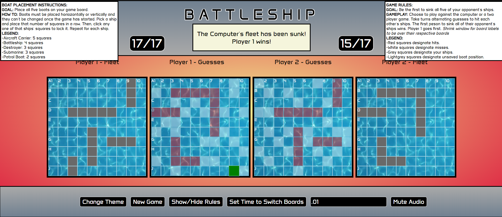
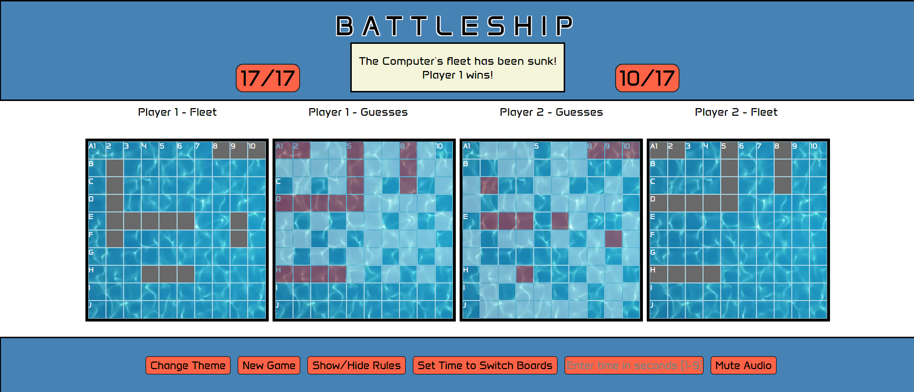

# Battleship 2
This is a bonus project that is a redesign of my first project for General Assembly.  It takes my first game of Battleship and converts it into a an Express app using a TypeScript server.  Users can now sign in and play the game of Battleship.  The game will increment a score, wins, losses, and games played for each user.  There is now a Leaderbord page to display all users' scores.  The user with the highest score will be at the top.  For more information regarding the first project, see this GitHub repo: https://github.com/nickldimartino/Battleship-Game.

# Screenshot

# Technologies Used

- TypeScript
- Postman
- Axios
- Express
- Node
- OAuth with Passport and Google Strategy
- MongoDB/Mongoose
- JavaScript
- EJS
- HTML
- CSS

# Getting Started

Link to the app hosted on Heroku:
https://ai-platforms-list-crud-64ab4f9bb249.herokuapp.com/platforms

# Next Steps

- Find and fix possible bugs
- Refactor code
- Enhance the computer AI to make more knowledgable guesses