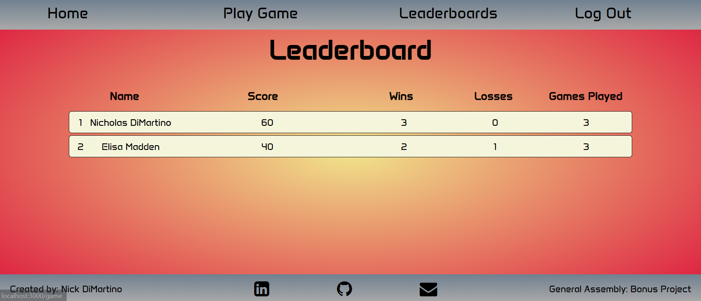

# <h1 align="center">Battleship 2</h1>
#### <h3 align="center"><a href="https://battleship-two-404cb7137cf0.herokuapp.com/">Play on Heroku!</a></h3>

  
 

## 📝 Description
This is a bonus project that is a redesign of my first project for General Assembly.  It takes my first game of Battleship and converts it into a an Express app using a TypeScript server.  Users can now sign in and play the game of Battleship.  The game will increment a score, wins, losses, and games played for each user.  There is now a Leaderbord page to display all users' scores.  The user with the highest score will be at the top.  For more information regarding the first project, see this <a href="https://github.com/nickldimartino/Battleship-Game">GitHub repo</a>.

## 🖼️ Screenshots

 
 📊 Gameplay

 
 | Description | Screenshot |
 |------------ | ------------|
 | <h3 align="center">Primary Theme</h3> | 
 | <h3 align="center">Classic Theme</h3> | 
 | <h3 align="center">Leaderboard</h3> | 
 

## 💻 Technologies Used

## ⚛️ Getting Started
### 📲 Instructions

How to Play the Game

 
1. Navigate to the nav bar on the top of the screen and click "Play Game".
 
2. Game is set for two players. Click the "Computer Player" button if you wish to play against to the computer.
 
3. Place your boats using the rules in the top-left of the screen.

4. Take turns guessing the other player's ships.  The first person to hit all other their opponent's boats (17 squares) wins!  Select "New Game" to play again.

5. The theme of the game, audio, and board switch delay can be modified.

Viewing the Leaderboards

1. Navigate to the nav bar on the top of the screen and click "Leaderboards".
 
2. A list of the players that have played the game will be displayed here.  The score is based on the number of hits and wins a player has.

### 🔗 Links

Deployed Link (Heroku)

<a href="https://battleship-two-404cb7137cf0.herokuapp.com/">https://battleship-two-404cb7137cf0.herokuapp.com/</a>

Note: A security risk screen may appear.  This can be bypassed using the "details" button and "continue to site anyway" link.

Original GitHub Code from Battleship 1

<a href="https://github.com/nickldimartino/Battleship-Game">https://github.com/nickldimartino/Battleship-Game</a>

## ⏭️ Next Steps
 
- [ ] Find and fix possible bugs
- [ ] Refactor code
- [ ] Enhance the computer AI to make more knowledgable guesses